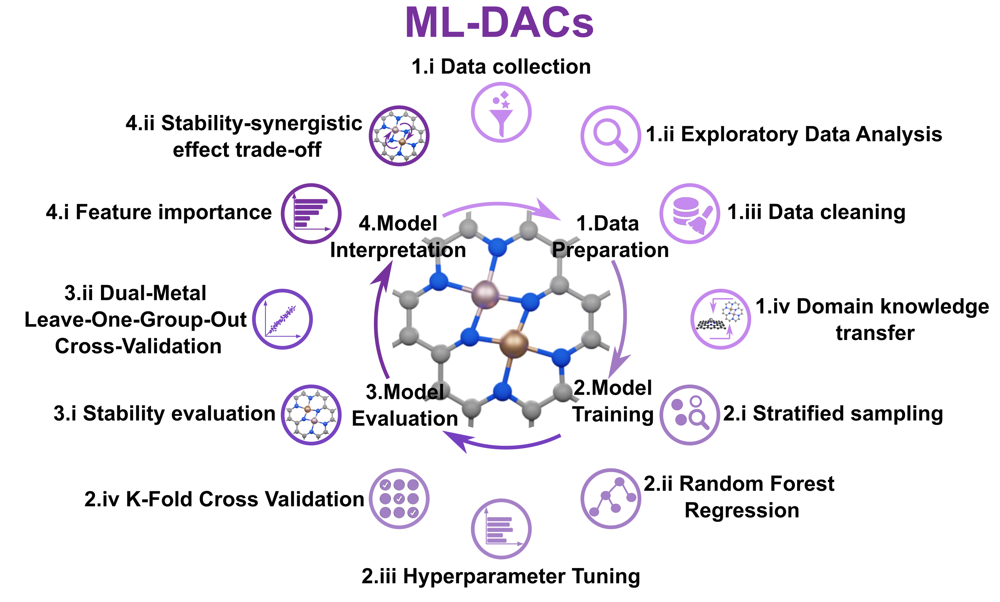

<p align="center">
  
</p>

<p align="center">
  <a href="https://github.com/mminotaki/ML-DACs" target="_blank" rel="noopener noreferrer">
    
  </a>
  <a href="https://doi.org/10.26434/chemrxiv-2025-pjdpq" target="_blank" rel="noopener noreferrer">
    
  </a>
  <a href="https://www.gnu.org/licenses/gpl-3.0.en.html" target="_blank" rel="noopener noreferrer">
    
  </a>
  <a href="https://www.python.org" target="_blank" rel="noopener noreferrer">
    
  </a>
</p>

---

## 📖 Overview

**Machine Learning Framework for Stability Evaluation of Dual-Atom Catalysts** or **ML-DACs** is a Python package designed to evaluate the stability of dual-atom catalysts (DACs) against aggregation into nanoparticles using a machine learning approach based on Random Forest Regression. This framework automates the workflow from data preprocessing to model training and evaluation, enabling researchers to efficiently predict catalyst stability and accelerate catalyst design.

---

## 🚀 Features

- 🔬 **Dual-Atom Catalyst Analysis**: Built specifically for handling DACs or any Single-Atom Catalysts datasets.
- 🧠 **Machine Learning Pipeline**: Preprocessing, training, evaluation, and feature selection all in one.
- 🌳 **Random Forest Regression**: Flexible error evaluation using K-Fold and Dual-Metal LOGOCV.
- 📊 **Insightful Visualizations**: Parity plots, error distributions, and model performance trends.

---

## ⚙️ Installation

To install ML-DACs, clone this repository and install the dependencies:

```bash
git clone https://github.com/mminotaki/ML-DACs.git
cd ML-DACs
pip install -r requirements.txt
```
---

## 🤝 Contributing

We welcome contributions and suggestions!
If you find bugs, want to add new features, or improve documentation:

Fork the repo

Create your feature branch: git checkout -b feature/your-feature

Commit your changes

Open a pull request

---

## 📚 Reference

If you use **ML-DACs** in your work, please cite our preprint:

> Maria G. Minotaki and Núria López.  
> **Transfer learning with domain knowledge adaptation for stability evaluation of dual-atom catalysts on nitrogen-doped carbon.**  
> *ChemRxiv* (2025). https://doi.org/10.26434/chemrxiv-2025-pjdpq

---

## 📖 BibTeX

```bibtex
@article{Minotaki2025,
  author       = {Minotaki, M. G. and López, N.},
  title        = {Transfer learning with domain knowledge adaptation for stability evaluation of dual-atom catalysts on nitrogen-doped carbon},
  journal      = {ChemRxiv},
  year         = {2025},
  doi          = {10.26434/chemrxiv-2025-pjdpq},
  note         = {This content is a preprint and has not been peer-reviewed}
}
```
---
## 📄 License

This project is licensed under the MIT License - see the [LICENSE](LICENSE) file for details.